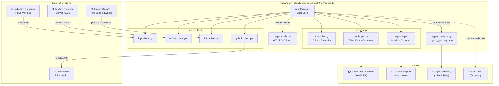
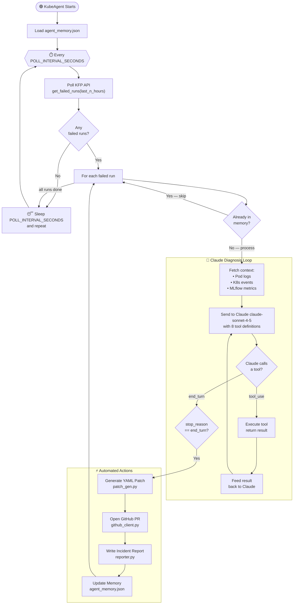
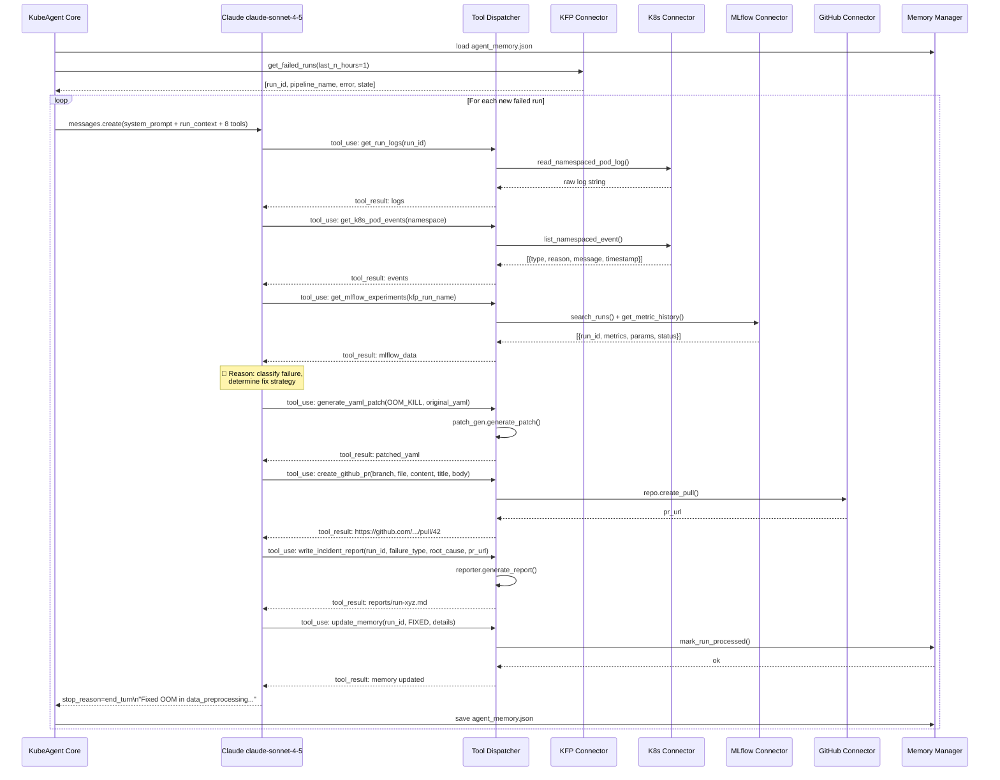
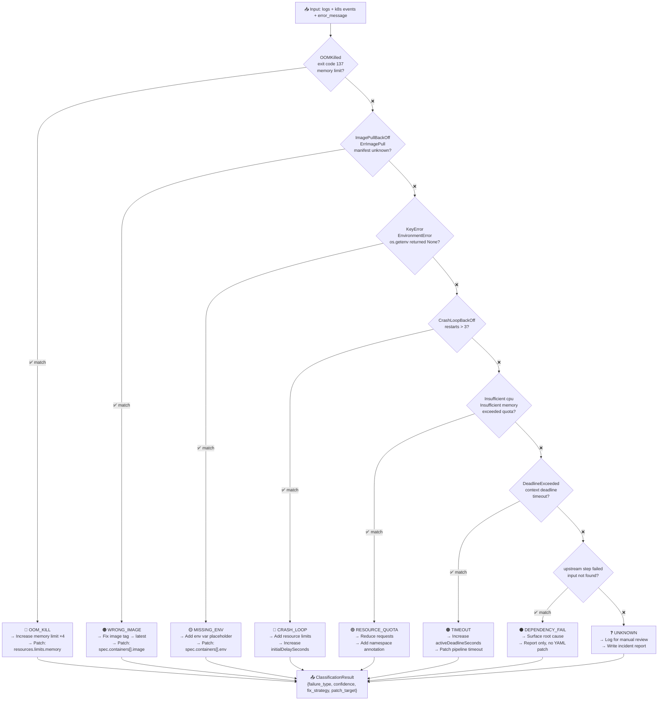
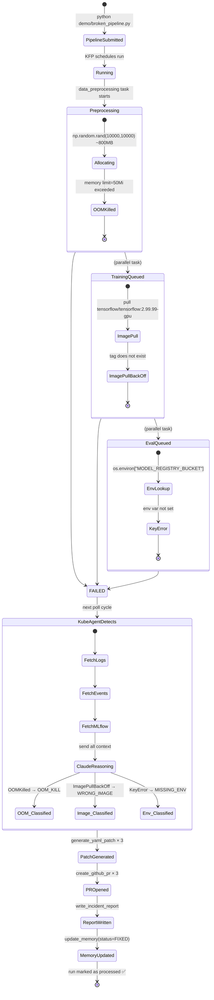
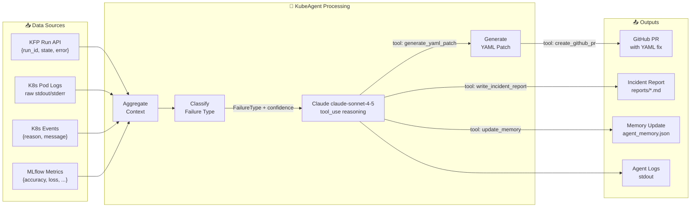
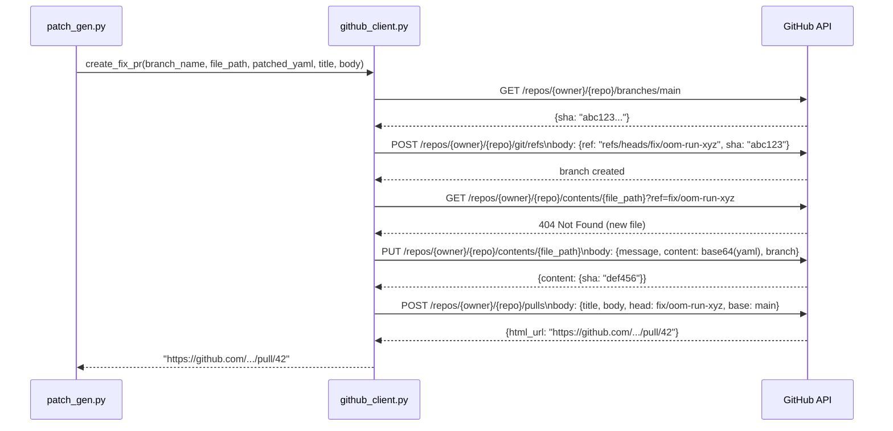
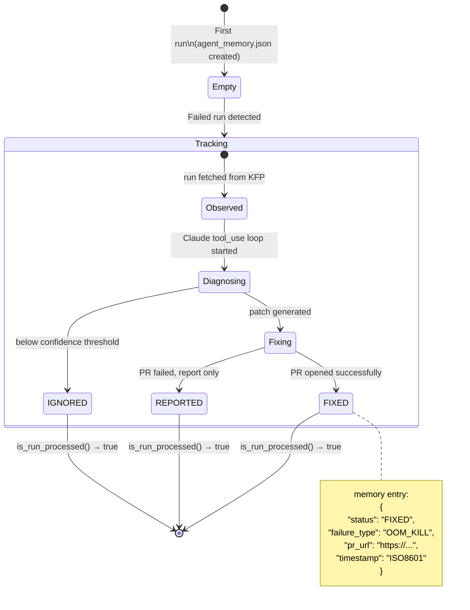
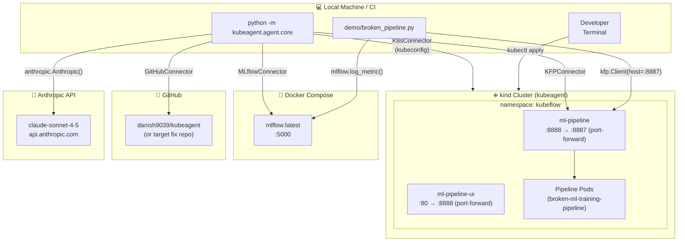

# KubeAgent — System Diagrams

> All diagrams use [Mermaid](https://mermaid.js.org/) syntax. They render natively on GitHub, Notion, and most modern markdown viewers.

---

## 1. High-Level System Architecture

---

## 2. Agent Poll Cycle — Flowchart

---

## 3. Multi-Turn Claude Tool-Use Loop — Sequence Diagram

---

## 4. Failure Classification — Decision Tree

---

## 5. Component Interaction — Class Diagram

```mermaid
classDiagram
    class KubeAgent {
        +Settings settings
        +MemoryManager memory
        +Anthropic anthropic_client
        +KFPConnector _kfp
        +MLflowConnector _mlflow
        +K8sConnector _k8s
        +GitHubConnector _github
        +FailureClassifier classifier
        +YAMLPatchGenerator patch_gen
        +IncidentReporter reporter
        +run()
        +_run_cycle()
        +_process_failed_run(run)
        +_call_claude(messages)
        +_handle_tool_use(tool_name, tool_input)
    }

    class MemoryManager {
        +str memory_path
        +load() dict
        +save(memory)
        +is_run_processed(run_id) bool
        +mark_run_processed(run_id, status, details)
        +update_stats(failure_type)
        +get_recent_incidents(limit) list
    }

    class KFPConnector {
        +kfp.Client client
        +get_failed_runs(last_n_hours, namespace) List
        +get_run_details(run_id) Dict
        +get_run_logs(run_id, max_lines) str
        +retry_run(run_id) bool
        +list_experiments() List
    }

    class MLflowConnector {
        +MlflowClient client
        +get_recent_runs(experiment_name_filter, last_n_runs) List
        +get_run_metrics_history(run_id, metric_key) List
        +detect_metric_degradation(run_id, metric_key, threshold) bool
        +correlate_with_kfp_run(kfp_run_name) Optional~Dict~
    }

    class K8sConnector {
        +CoreV1Api v1
        +get_pod_events(namespace, pod_name_prefix) List
        +get_pod_logs(namespace, pod_name, tail_lines) str
        +get_failed_pods(namespace) List
        +list_pods_for_run(namespace, run_id) List~str~
    }

    class GitHubConnector {
        +Github github
        +Repository repo
        +create_fix_pr(branch_name, file_path, file_content, pr_title, pr_body) str
        +pr_exists_for_branch(branch_name) bool
        +_get_or_create_branch(repo, branch_name, base_branch) str
        +_file_exists(repo, file_path, branch) Tuple
    }

    class FailureClassifier {
        +classify(logs, events, error_message) ClassificationResult
        +_match_patterns(text, patterns) List~str~
        +_calculate_confidence(matched, total) float
    }

    class YAMLPatchGenerator {
        +generate_patch(failure_type, original_yaml, suggested_fix) str
        +_fix_oom(manifest, suggested_fix) dict
        +_fix_wrong_image(manifest, suggested_fix) dict
        +_fix_missing_env(manifest, suggested_fix) dict
        +_fix_crash_loop(manifest, suggested_fix) dict
        +_increase_memory(current_value, multiplier) str
    }

    class IncidentReporter {
        +str reports_dir
        +generate_report(run_id, failure_type, root_cause, fix_applied, pr_url, mlflow_correlation) str
        +_format_events_table(events) str
        +_format_metrics(metrics) str
    }

    class Settings {
        +str kfp_endpoint
        +str mlflow_tracking_uri
        +str github_token
        +str anthropic_api_key
        +int poll_interval_seconds
        +int lookback_hours
        +validate()
    }

    KubeAgent --> MemoryManager
    KubeAgent --> KFPConnector
    KubeAgent --> MLflowConnector
    KubeAgent --> K8sConnector
    KubeAgent --> GitHubConnector
    KubeAgent --> FailureClassifier
    KubeAgent --> YAMLPatchGenerator
    KubeAgent --> IncidentReporter
    KubeAgent --> Settings
```

---

## 6. Demo Scenario — State Diagram

---

## 7. Data Flow — End-to-End

---

## 8. GitHub PR Creation Flow

---

## 9. Memory State Machine

---

## 10. Deployment Architecture (kind + Docker)

